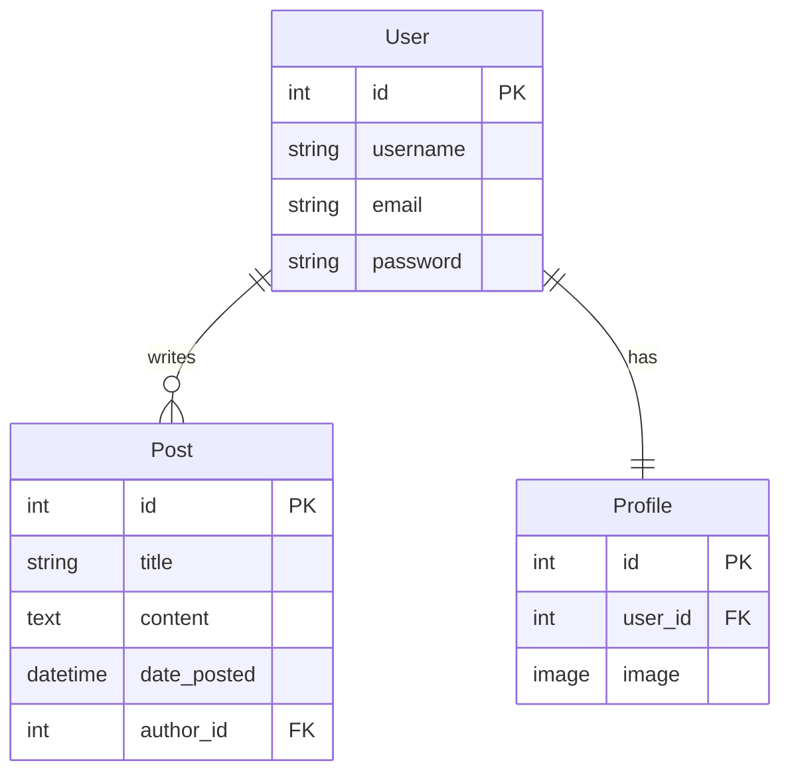

<div align="center">

# 📝 Django Blog Website

A full-featured blog application with user authentication, profile management, and a clean Bootstrap 4 UI.

[](https://python.org)
[](https://djangoproject.com)
[](https://getbootstrap.com)
[](https://github.com/astral-sh/uv)
[](LICENSE)
[](https://github.com/psf/black)

<br/>

> ⚠️ **Screenshot coming soon** — add one here once the app is styled up!
>
> ``

</div>

---

## ✨ Features

- 📰 **Blog feed** — list all posts with author, date, and content on the home page
- 👤 **User registration** — custom sign-up form with email field built on Django's `UserCreationForm`
- 🖼️ **User profiles** — each user gets a profile with an avatar image (powered by Pillow)
- ✉️ **Flash messages** — success/error feedback on registration and form actions
- 💅 **Crispy Forms** — Bootstrap 4 form rendering via `django-crispy-forms`
- 🔐 **Django Admin** — manage posts, users, and profiles out of the box

---

## 🗂️ Data Model



---

## 🗺️ URL Routes

| URL | View | Name |
|-----|------|------|
| `/` | `blog.views.home` | `blog-home` |
| `/about/` | `blog.views.about` | `blog-about` |
| `/register/` | `users.views.register` | `register` |
| `/admin/` | Django Admin | — |

---

## 📁 Project Structure

```
django-blog-website/
├── pyproject.toml          # Dependencies & project config
├── uv.lock
└── django_blog/
    ├── manage.py
    ├── django_blog/        # Project settings & root URLs
    │   ├── settings.py
    │   └── urls.py
    ├── blog/               # Blog app
    │   ├── models.py       # Post model
    │   ├── views.py
    │   ├── urls.py
    │   ├── admin.py
    │   ├── templates/blog/
    │   │   ├── base.html
    │   │   ├── home.html
    │   │   └── about.html
    │   └── static/blog/
    │       └── main.css
    └── users/              # Auth & profiles app
        ├── models.py       # Profile model
        ├── views.py
        ├── forms.py        # UserRegisterForm
        └── templates/users/
            └── register.html
```

---

## 🚀 Getting Started

### Prerequisites

- Python 3.14+
- [uv](https://docs.astral.sh/uv/getting-started/installation/)

### Installation

```bash
# 1. Clone the repo
git clone https://github.com/Kalebm749/django-blog-website.git
cd django-blog-website

# 2. Install dependencies (uv handles the venv automatically)
uv sync

# 3. Apply migrations
uv run django_blog/manage.py migrate

# 4. (Optional) Create an admin superuser
uv run django_blog/manage.py createsuperuser

# 5. Start the dev server
uv run django_blog/manage.py runserver
```

Then visit 👉 **http://127.0.0.1:8000**

---

## 🛠️ Development

```bash
# Format Python with Black
uv run black .

# Format Django HTML templates with djlint
uv run djlint django_blog --reformat --profile django

# Run type checking
uv run mypy django_blog
```

### VS Code Setup

This project includes a `.vscode/settings.json` pre-configured with:
- **djlint** as the Django HTML formatter (format on save)
- **Black** as the Python formatter (format on save)
- **Pylance** type checking set to `basic`
- `django-html` language mode for all `.html` files

Recommended extensions: `batisteo.vscode-django`, `monosans.djlint`, `ms-python.black-formatter`

---

## 📦 Dependencies

| Package | Purpose |
|---------|---------|
| `django` | Web framework |
| `django-crispy-forms` | Form rendering helpers |
| `crispy-bootstrap4` | Bootstrap 4 template pack for crispy |
| `pillow` | Image handling for user profile pictures |
| `django-stubs` | Type stubs for Pylance/mypy |
| `djlint` | Django template linter & formatter |
| `black` *(dev)* | Python code formatter |

---

## 🤝 Contributing

Pull requests are welcome! For major changes, please open an issue first to discuss what you'd like to change.

1. Fork the repo
2. Create a feature branch (`git checkout -b feature/cool-thing`)
3. Commit your changes (`git commit -m 'feat: add cool thing'`)
4. Push to the branch (`git push origin feature/cool-thing`)
5. Open a Pull Request

---

## 📄 License

This is free and unencumbered software released into the public domain. See [UNLICENSE](LICENSE) for more information.

---

## 🙏 Acknowledgements

This project was built following [Corey Schafer's Django Tutorial](https://www.youtube.com/playlist?list=PL-osiE80TeTtoQCKZ03TU5fNfx2UY6U4p) — one of the best free resources for learning Django from scratch. If you're just getting started with Django, go watch it.

---

## 🧑‍💻 Authorship

This project was written by a human. AI was used as a tool, not a ghostwriter. See [AI.CONTRIB](AI.CONTRIB.md) for a full breakdown.

| Category | 👤 Human | 🤖 AI |
|---|---|---|
| Code written | ✅ | ⬜ |
| Code reviewed | ✅ | ✅ |
| Bugs fixed | ✅ | ✅ |
| Architecture / planning | ✅ | ⬜ |
| Documentation | ✅ | ✅ |
| Tests | ⬜ | ⬜ |

> 👤 Human **65%** — 🤖 AI **35%** · See [AI.CONTRIB.md](AI.CONTRIB.md) for the full breakdown.

**Authorship alignment:**

```
👤 Human                                          🤖 AI
├──────────────────────────────────┤──────────────────┤
        65%  human-written                35%  AI-assisted
```
> This table exists because AI involvement in software projects exists on a spectrum, and that spectrum deserves to be visible. ✅ = involved · ⬜ = not involved.

---

<div align="center">
  <sub>Built with ❤️ by <a href="https://github.com/Kalebm749">Kalebm749</a></sub>
</div>