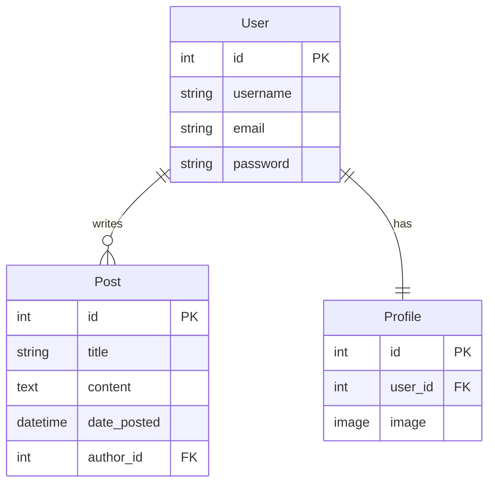

<div align="center">

# 📝 Django Blog Website

A full-featured blog application built with Django featuring user authentication, profile management, and a clean Bootstrap 4 interface.

[](https://python.org)
[](https://djangoproject.com)
[](https://getbootstrap.com)
[](https://github.com/astral-sh/uv)
[](LICENSE)

<br/>

> **Screenshot coming soon.**

</div>

---

## ✨ Features

* User registration with a custom registration form
* User authentication using Django's built-in authentication system
* User profiles with avatar image uploads (Pillow)
* Blog homepage with posts, author information, and timestamps
* Bootstrap 4 responsive interface
* Crispy Forms integration for clean form rendering
* Django Admin for managing users, profiles, and blog content
* SQLite development database

---

## 🗂️ Data Model



---

## 🗺️ URL Routes

| URL          | View                   | Name         |
| ------------ | ---------------------- | ------------ |
| `/`          | `blog.views.home`      | `blog-home`  |
| `/about/`    | `blog.views.about`     | `blog-about` |
| `/register/` | `users.views.register` | `register`   |
| `/admin/`    | Django Admin           | —            |

---

## 📁 Project Structure

```text
django-blog-website/
├── blog/
│   ├── migrations/
│   ├── static/
│   ├── templates/
│   ├── admin.py
│   ├── apps.py
│   ├── models.py
│   ├── urls.py
│   └── views.py
├── users/
│   ├── migrations/
│   ├── templates/
│   ├── forms.py
│   ├── models.py
│   └── views.py
├── django_blog/
│   ├── settings.py
│   ├── urls.py
│   ├── asgi.py
│   └── wsgi.py
├── media/
├── manage.py
├── pyproject.toml
├── uv.lock
└── README.md
```

---

## 🚀 Getting Started

### Prerequisites

* Python 3.14+
* [uv](https://docs.astral.sh/uv/getting-started/installation/)

### Installation

```bash
# Clone the repository
git clone https://github.com/Kalebm749/django-blog-website.git
cd django-blog-website

# Install dependencies
uv sync

# Apply database migrations
uv run manage.py migrate

# Create an administrator account (optional)
uv run manage.py createsuperuser

# Start the development server
uv run manage.py runserver
```

Open your browser to:

**http://127.0.0.1:8000**

---

## 🛠️ Development

### Common Commands

```bash
# Start the development server
uv run manage.py runserver

# Create new migrations
uv run manage.py makemigrations

# Apply migrations
uv run manage.py migrate

# Run tests
uv run manage.py test

# Validate the project
uv run manage.py check

# Open the Django shell
uv run manage.py shell
```

### Formatting

Format Python code with Black:

```bash
uv run black .
```

Format Django templates with djlint:

```bash
uv run djlint . --reformat --profile django
```

---

## 📦 Dependencies

| Package             | Purpose                                        |
| ------------------- | ---------------------------------------------- |
| Django              | Web framework                                  |
| django-crispy-forms | Bootstrap-friendly form rendering              |
| crispy-bootstrap4   | Bootstrap 4 template pack                      |
| Pillow              | Image uploads for user profile pictures        |
| Black               | Python formatter                               |
| djlint              | Django template formatter and linter           |
| django-stubs        | Type information for editors and type checkers |

---

## 🤝 Contributing

Contributions are welcome.

1. Fork the repository.
2. Create a feature branch.
3. Commit your changes.
4. Push your branch.
5. Open a Pull Request.

---

## 📄 License

This project is released under the Unlicense. See the [LICENSE](LICENSE) file for details.

---

## 🙏 Acknowledgements

This project was built while following Corey Schafer's outstanding Django tutorial series, with additional features, refactoring, and continued development beyond the tutorial.

---

## 🧑‍💻 AI Transparency

This project is human-developed with AI used as an engineering assistant for documentation, reviews, brainstorming, debugging, and refactoring suggestions. Design decisions, implementation, and final code review remain human-directed.

---

<div align="center">
  <sub>Built by <a href="https://github.com/Kalebm749">Kaleb Moore</a></sub>
</div>
